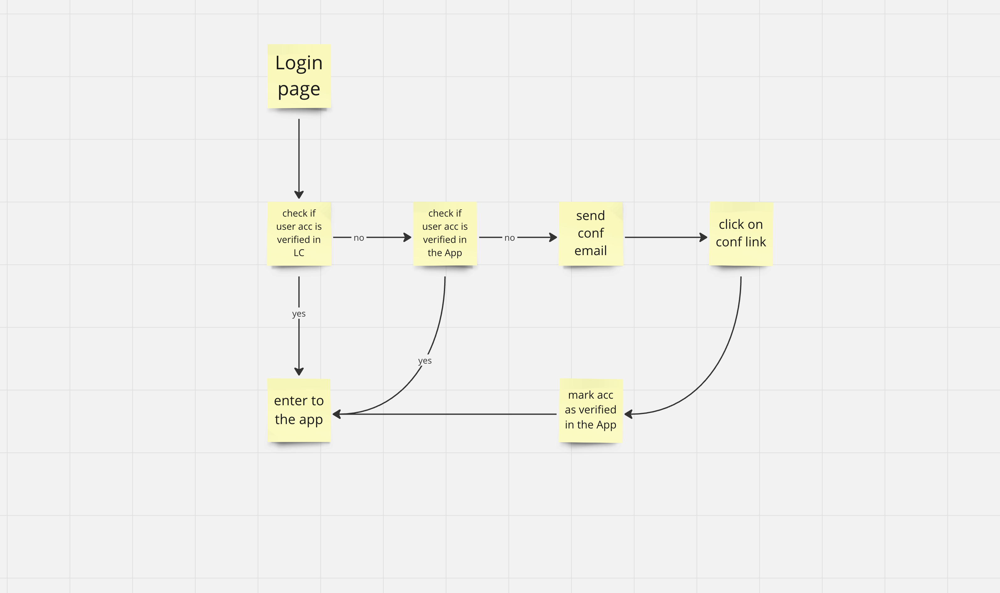

## Business description
The goal is to introduce a required e-mail verification in Text.com.
Every product under Text.com will use this mechanism (new accounts and existing ones will be required to be verified).
Under the account there are paid roles to access different products.
As the account is a master entity.

MVP of this projects is about only verification with e-mail.
### Out of scope:
- registration
- 2FA
- error management
- invalid url handling

### Metrics
- how the feature influence the conversion to paid roles

## Current technical solution
Currently activation e-mail is sent but user can access app normally with not verified e-mail.

## Proposed solution
We will duplicate flow of activation e-mail.

1. If user is active in LiveChat, we let them in.
2. If user is not active in LiveChat, we will check in app if user is verified.
3. If user is not verified, we will send activation e-mail.

We will save a token in the DB (now it's in memory).
When user clicks on the link, we will check if token is valid and if it is, we will mark user as verified.
Valid link means that token is in DB and it's not expired (1hr).

## Security considerations
1. Login with external IDP - tbd
2. Link validity - reusing it or attempt to modify
- we send randomly generated token with no additional informations
- we save token in DB with creation date so it will expire after 1hr
3. Rate limiting - limit number of requests for activation link - tbd
